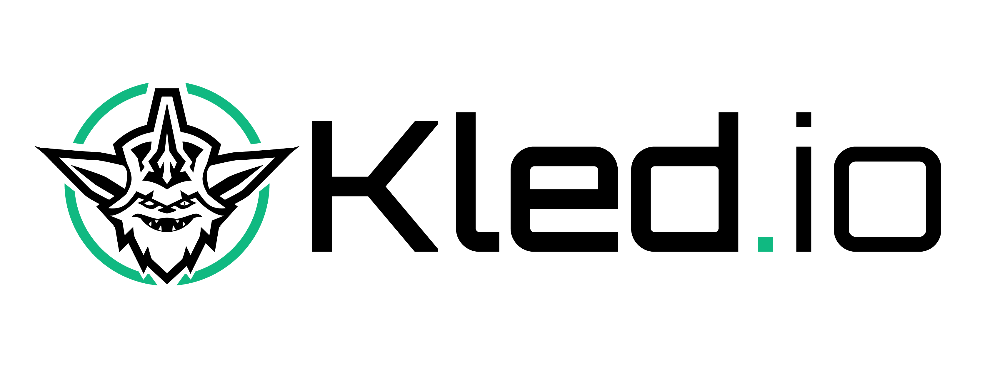
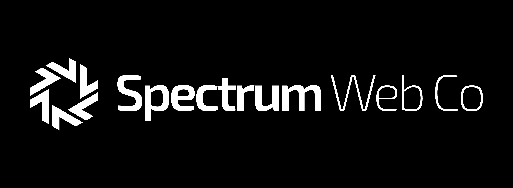
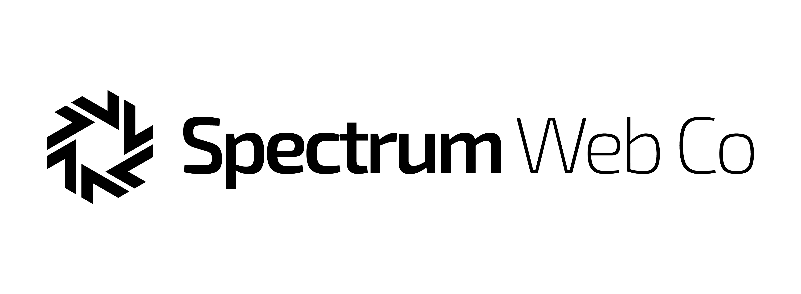
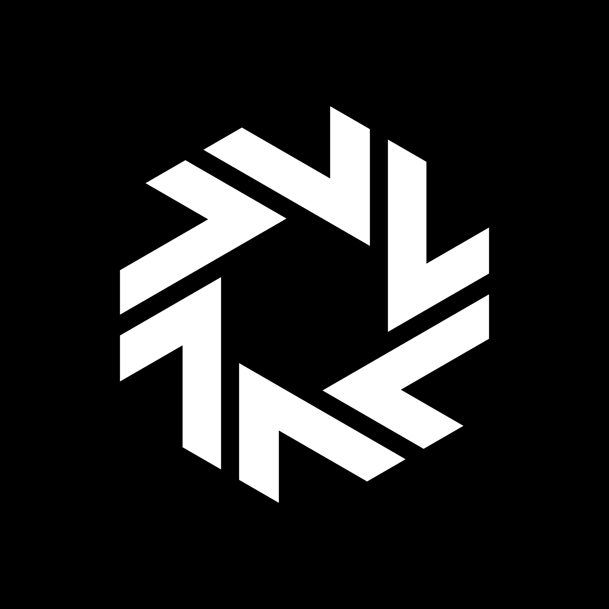
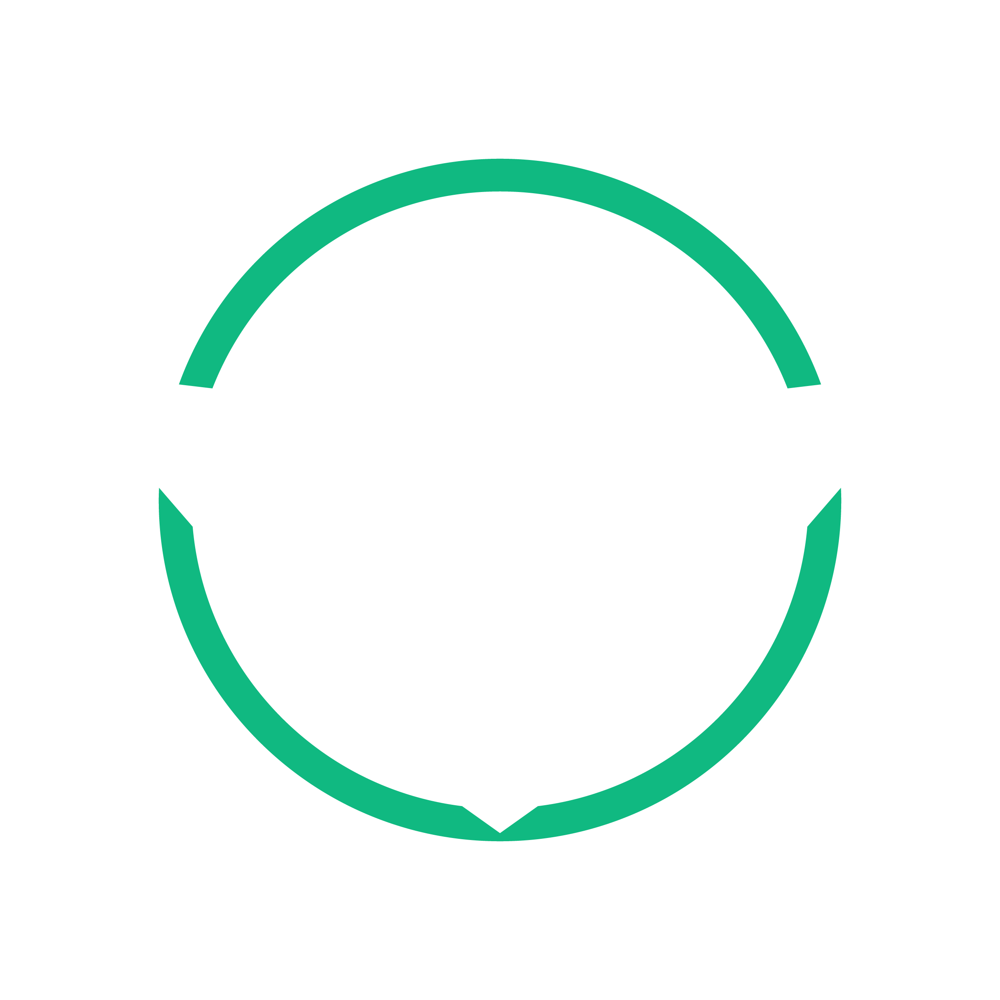

# Kled.io - Agent Runtime Ecosystem

<p align="center">
  <picture>
    <source media="(prefers-color-scheme: dark)" srcset="images/kled-io-dark.png" width="400">
    <source media="(prefers-color-scheme: light)" srcset="images/kled-io-light.png" width="400">
    
  </picture>
</p>

A comprehensive Agent Runtime Ecosystem designed specifically for adopting end-to-end AI/ML into business processes for Australian enterprises. Kled.io enables organizations to maintain data governance in-house while modernizing their infrastructure.

## Overview

<p align="center">
  
</p>

Kled.io by Spectrum Web Co is a powerful Agent Runtime Ecosystem that addresses the low Kubernetes adoption rate in Australian enterprises (approximately 70% don't use Kubernetes) by providing tools that enable organizations to:

- Create, configure, and execute AI-powered agents for software engineering tasks
- Maintain data governance in-house while modernizing infrastructure
- Deploy in containerized environments with proper monitoring (Prometheus, Grafana, Thanos, Loki)
- Keep data on their own servers or cloud infrastructure
- Integrate with existing systems through a flexible multi-agent architecture

<p align="center">
  
</p>

The platform consists of:

- Cobra-based Go CLI tools
- React-based web application with Shadcn UI and Aceternity UI
- Lynx-based mobile application
- Tauri v2 desktop applications
- SpacetimeDB Server for frontend state management
- Supabase self-hosted instance
- Slack authentication with automatic customer addition

## Multi-Agent Architecture

<p align="center">
  
</p>

Kled.io implements a sophisticated multi-agent architecture powered by LangGraph and LangChain-Go:

- **Software Engineering Agent**: Core development tasks with Gemini 2.5 Pro
- **UI/UX Agent**: Frontend development with modern UI frameworks
- **App Scaffolding Agent**: Application assembly and infrastructure setup
- **Codegen Agent**: Specialized code generation for various languages

<p align="center">
  
</p>

## Key Features

- **Agent System**: Manages execution loops, state tracking, and command execution
- **Shared Application State**: Enables Generative UI with synchronized frontend/backend state
- **LangGraph Integration**: Facilitates communication between specialized agents
- **Modern UI**: Built with Shadcn UI and Aceternity UI components
- **AI SDK 4.2**: Integrates with Vercel AI SDK for advanced AI capabilities
- **Multi-Model Support**: Gemini 2.5 Pro (coding), Llama 4 (operations and reasoning)
- **Event Stream System**: Distributes events with DragonflyDB caching
- **MCP (Model Control Plane)**: Provides interfaces for models and tools

## Getting Started

### Installation

```bash
# Clone the repository
git clone https://github.com/spectrumwebco/agent_runtime.git
cd agent_runtime

# Install backend dependencies
pip install -r requirements.txt

# Install frontend dependencies
cd frontend
npm install
```

### Environment Setup

Create a `.env` file based on the provided `.env.example`:

```bash
cp .env.example .env
```

Edit the `.env` file to set your API credentials and configuration.

### Running the Application

```bash
# Start the backend
cd backend
python manage.py runserver

# Start the frontend
cd frontend
npm run dev
```

Visit `http://localhost:3000` to access the Kled.io interface.

## Components

<p align="center">
  
</p>

Kled.io consists of several key components:

- **Agent System**: Core agent implementation with execution loop and state management
- **Multi-Agent Framework**: LangGraph-based system for agent communication
- **Shared State System**: Synchronizes state between frontend and backend
- **Frontend UI**: Modern interface built with React 19, Shadcn UI, and Aceternity UI
- **Backend Services**: Go and Python services for agent execution
- **Kubernetes Integration**: Deployment configurations for containerized environments
- **Terraform Modules**: Infrastructure as Code for cloud deployments

## Directory Structure

- **cmd/**: Contains CLI entry points for Cobra-based tools
- **pkg/**: Contains core packages intended for external use
- **internal/**: Contains packages for internal use
  - api/: API endpoints for frontend communication
  - langgraph/: LangGraph implementation for agent communication
  - langchain/: LangChain-Go integration
  
- **frontend/**: React-based web application
  - src/components/: UI components and features
  - src/hooks/: Custom React hooks
  - src/services/: API services and integrations
  
- **k8s/**: All Kubernetes manifests and configurations
  - monitoring/: Prometheus, Grafana, Thanos, and Loki configurations
  - supabase/: Self-hosted Supabase instance
  - langsmith/: Self-hosted LangSmith for LangGraph
  
- **terraform/**: Infrastructure as Code
  - modules/: Terraform modules for each component
  - main.tf: Main Terraform configuration

## License

[MIT License](LICENSE)

---

<p align="center">
  <em>Kled.io - Empowering Australian enterprises with AI/ML adoption while maintaining data governance</em>
</p>
