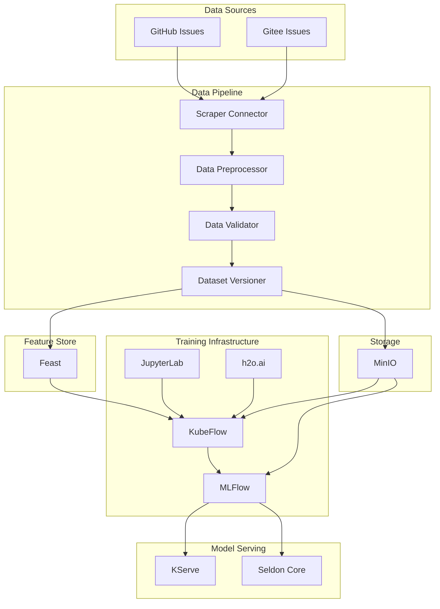
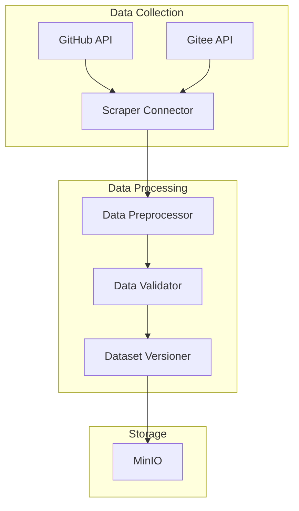
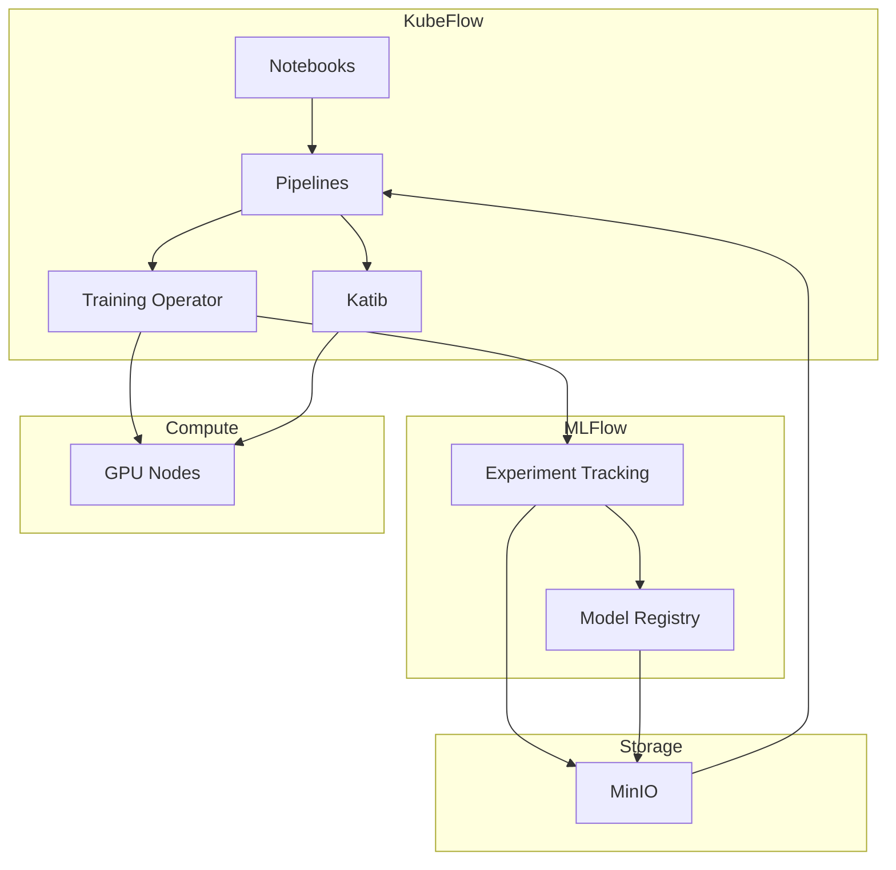
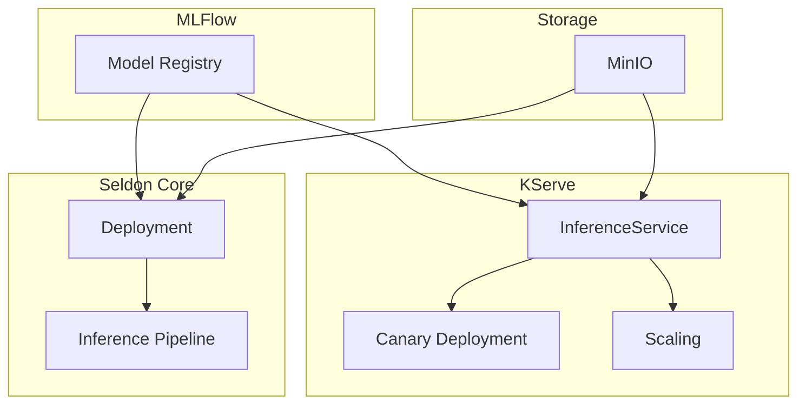
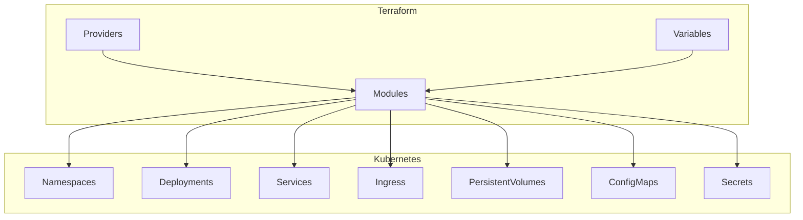
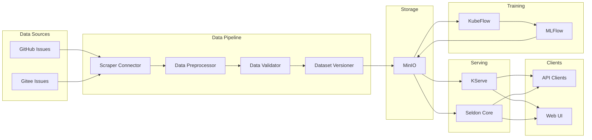
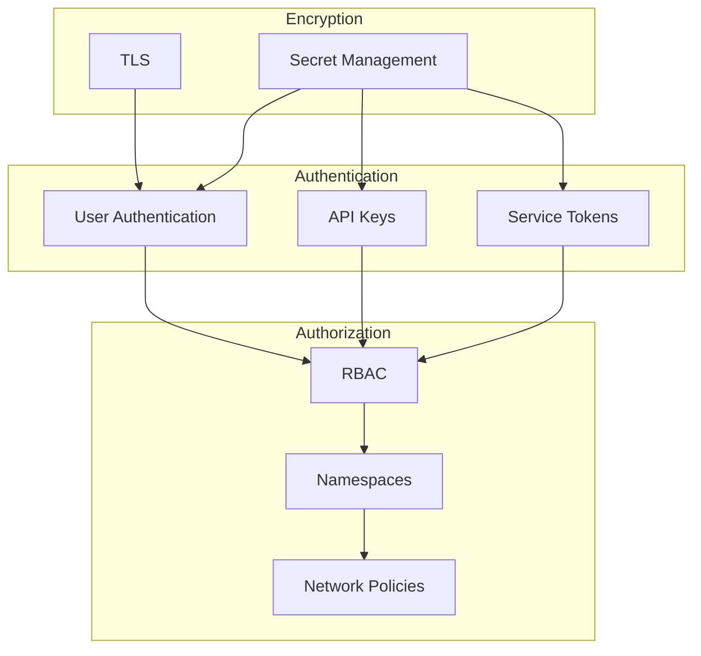

# ML Infrastructure Architecture

This document describes the architecture of the ML infrastructure for fine-tuning and evaluating Llama 4 models.

## System Architecture

The ML infrastructure follows a modular architecture with components deployed on Kubernetes. The system is designed to be scalable, resilient, and easy to maintain.

## Component Architecture

### Data Pipeline

The data pipeline collects, processes, and prepares training data from GitHub and Gitee repositories.

### Training Infrastructure

The training infrastructure orchestrates the fine-tuning of Llama 4 models.

### Model Serving

The model serving infrastructure deploys and serves trained models.

## Deployment Architecture

The ML infrastructure is deployed on Kubernetes using a combination of Kubernetes manifests and Terraform configurations.

## Data Flow

The following diagram illustrates the data flow through the ML infrastructure.

## Security Architecture

The ML infrastructure implements security at multiple levels.

